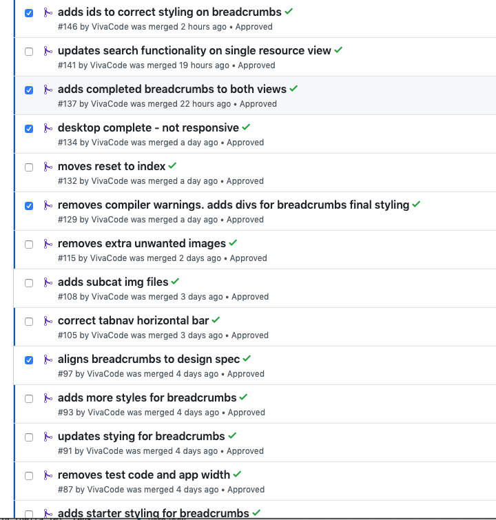
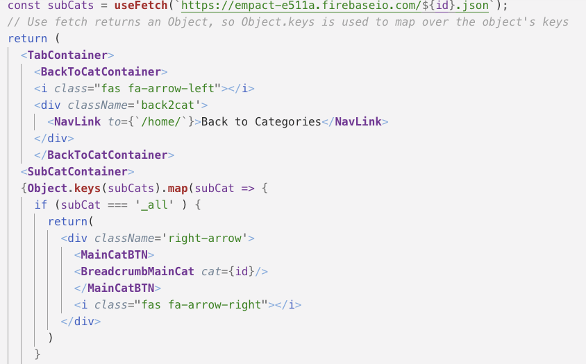
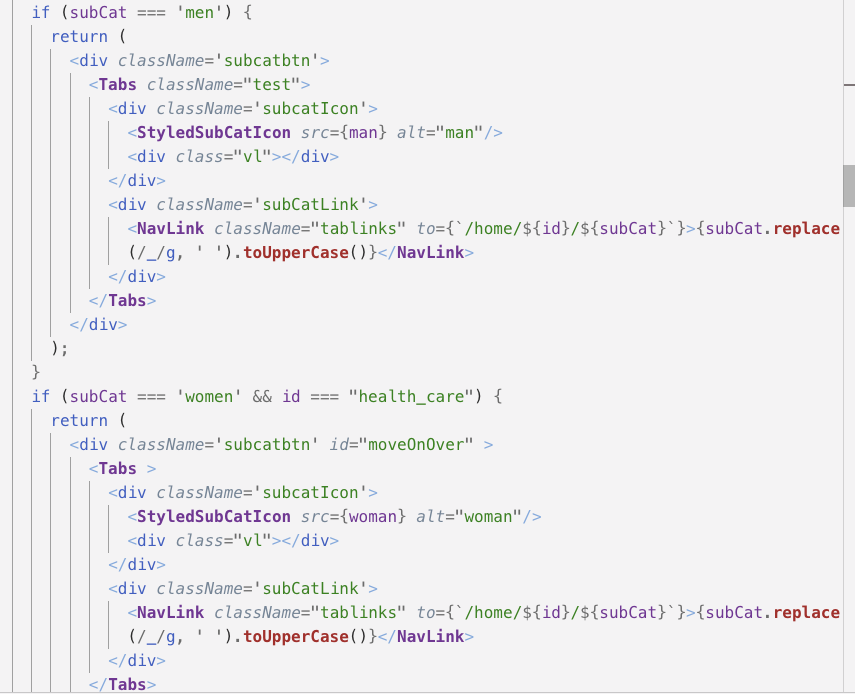
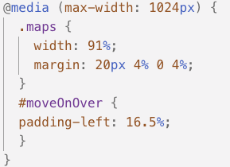

completed https://trello.com/c/RpFmjNwD/115-breadcrumb-tab-nav-component-w-back-to-categories-button
https://trello.com/c/hnhophLR/157-tablet-and-mobile-styles-for-breadcrumbs
---
title: Sprint Four
date: "2019-04-19"
---

Part 1 - Individual Accomplishments this Sprint

This sprint focused mostly on styling. Admittedly, a weakness of mine. I took charge of the breadcrumbs and proceeded to spend the whole week on it. The breadcrumb/ tab nav presented a unique challenge, because of the way the data was sourced from the database. I faced challenges isolating a single tab as well as setting unique images to each that were not living on the database. Matt was as always instrumental in breaking down the logic and helping me troubleshoot how to approch the more javascript focused problems. After overcoming those challenges and having the data displayed properly the next hurdle was creating responsive breakpoints. This seemed to move much faster and I put the final touches on last night. I did a lot of work on the breadcrumbs, but at some point each team memeber happily stepped in to help whenever some small hurddle presented itself. Overall, it was a great week and I was very happy with where we ended up.

Detailed Analysis
Completed Trello Tasks:
https://trello.com/c/RpFmjNwD/115-breadcrumb-tab-nav-component-w-back-to-categories-button
https://trello.com/c/hnhophLR/157-tablet-and-mobile-styles-for-breadcrumbs

There were 13 PRs associated with this weeks work on the breadcrumbs or tab navigator. What looks simple turned into a complicated piece of the site. The first challenge arose in isolating each tab for styling. The original data came through as an array including a listing of "all" for all resources under the main category. The styling had a set of cards below the nav showing all. The nav itself showed the main category button and the subsequent sub categories but didn't include displaying all.

Instead of setting all as a tab to display none. It was isolated and turned into the Main Category button with javascript. Then the remaining tabs were displayed and the main cat btn was stylable.

Because of the uniqueness of the array not allowing isolation of an individual tab to add images to each that were not housed in the database, if statements were utilized. Admittedly, it was not the DRYest way to complete this objective, but it was a workable solution. 

The responsive design required the use of an id on two indivual sub categories to isolate them and move them for proper alignment when downsizing to tablet only. Special attention was taken to counter the cascade and remove this id styling for the mobile view.

Part 2 - Weekly Reflection
This week the team was the most unified it's been yet in my opinion. That could be a shift in my own attitude from last week. I'm grateful to have had my own thing to work on and for the assistence of each memeber of the team as needed. Matt was great when it was a javascript issue that needed to be overcome. Pat and Caitlin really helped me when I had little hurdles I couldn't figure out. It proved that sometimes you just need an outside view. Each time they suggested additional divs to help isolate what I needed. At the end of the week when we were mostly done, we came together to talk about bigger issues and continuity that we had seen and group programmed those. 