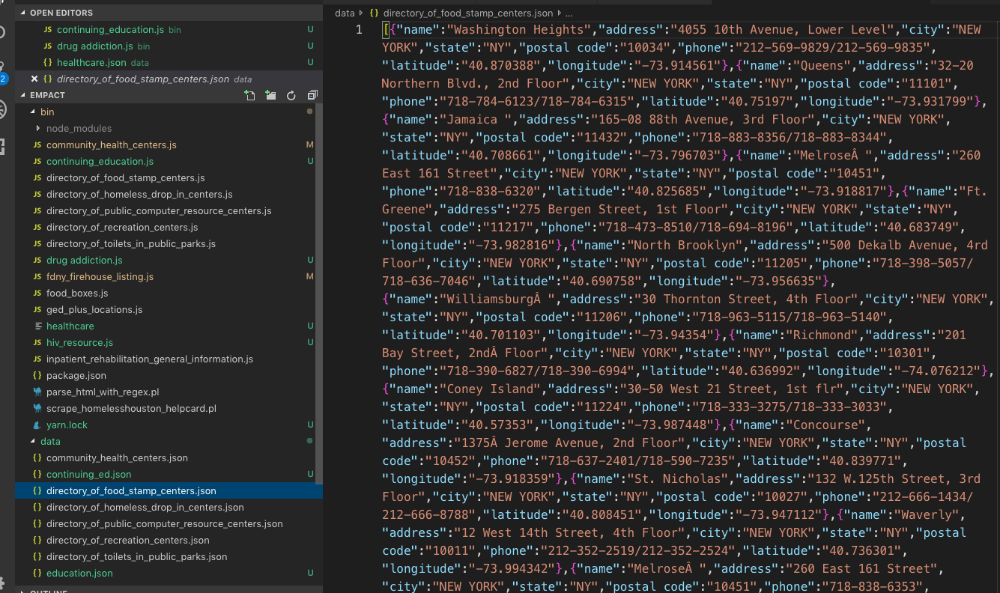
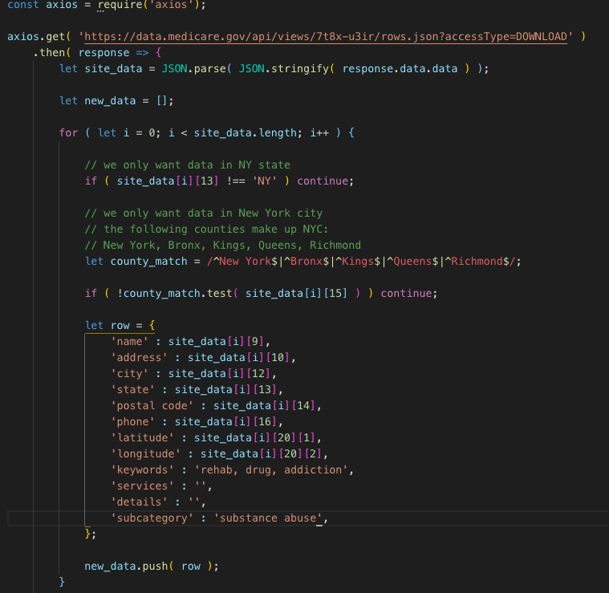

Provide a paragraph (5-8 sentences) summarizing the work you did over the course of this sprint, including the challenges you faced, the tools you used, and your accomplishments:

This week was mostly about planning. Over this week I contributed to the team in several ways. After a discussion on the problem we were trying to address. I suggested the name Empact. It combines the ideas of positive action, empathy and empowerment. I contributed to the team discussion and building of the TDD. I was primarily involved in the structuring and procuring of the data sets. As someone more comfortable with backend, I wanted to stretch myself and the project by incorporating technology I hadn't used before. AWS, MongoDB and Node were all considered, researched and attempted in some way. AWS turned out to be overly complicated and something that would take more time to learn that we had. MongoDB could have been used but I worried it was too much like react and not something that could impress future employers as a standout. I eventually came accross firebase. It seemed user friendly and unique to everything we had learned so far. I went to the team and explained why I thought it was a good idea. They graciously agreed to try it out. So far it has a lot of things we need and can easily implement add ons for future releases such as Oauth.

Pick one of your tickets and provide a detailed analysis of the work you did. This should be approximately ¼ page of text, and include screenshots if appropriate:

I was mainly responsible for research prior to the start of Labs. I compiled a list of APIs from which we could gather data. Once we realized the data sets were inconsistent in naming conventions, included data and usability. I started searching for a way to incorporate the data more easily. Originally, I believed we could manually manipulate the data and then seed it into a database with knex. Based on the amount of data involved I realized this was not practical. Under the guidance of someone with perl backend experience, I started building JS scripts that would take the data and recompile it in a more normalized way. I ended up creating a unique script for each dataset we found, changing the function based on how the data was structured to begin with. It ended up working very well and I was able to load one of these new json files to the database. 

It was decided that I could make a main Category listing in firebase and add the data to that branch. Firebase has a quirk that I'm learning to work with currently. Once you add data to a branch with import, you can not add additional data, bc it will overwrite it. To address this I'm recompiling the datasets with new data added to each. I have added a key for "subcategory", and "keywords". I'm prefilling the keywords with suggestions from Josh as well as my own ideas. Then I take each data set and create a "master set" for each main category. This will allow us to load all of the data at the same time. Eventually, a software such as ElasticSearch will be added to the project allowing full text searches. With the keywords hidden in the database, my plan is it will make searching more precise. 

Write ¼ to ½ a page reflecting on your individual contributions to analyzing the project specification and writing the TDD. Describe the research you personally conducted to find out information on a competitor, investigate a technical solution to a specific problem, or define your customers.

While the TDD itself was written as a team, I added several user stories:
 [As a vision-impaired user I need specific design considerations so that I can easily see the different options available to me inside the app.
]
[As a user with physical limitations, I need layouts with wide button spacing to accommodate my needs. 
] 
[As a user I want to search for resources so that access services quickly in the case of an emergency/crisis.] 
[As a user I want to use search so that I can locate services whose category I can’t readily i.d.]

While researching competitors as a team, I showed the team a houston website that corrals resources for people experiencing homeslessness into one place. It's a great resource but the main list view is long and cumbersome. The buttons are small so on a smaller screen it presents accessibility issues. There is currently only a desktop site. The search function doesn't work at all, it will pull a main category if you type only that category. The map is a static picture that doesn't link out to google maps. When considering all these things I suggested the buttons should be larger with more space between for physical limitations. I researched a way to do full text searching that would be compatible with firebase and discovered Elasticsearch. We added this as a stretch goal. The biggest challenge we have faced thus far is the maps api. That has very much been a team discussion and contribution. We have left it for more pressing matters, but will come back to it. 

As for technical research,  I have done a lot. I did most of the dataset accumilation. I have done all of the compiling and rebuilding of how the data is configured. I suggested firebase, bc of it's cloud capability, node tree/ NoSQL structure and ability to host. This has largely freed the team of having to build a backend. It has come with challenges learning how it works, building the react app with it and needing to bring in third party software like Travis CI to create continuous deployment. Despite the challenges, I think firebase was still worth the risk and work. I believe it's made us all better developers as we have done a lot of team programming to get everything working. The whole week we spent most days in a zoom researching and debugging together.

